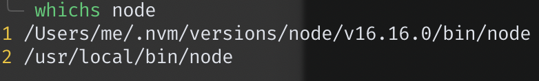

# whichs

## description
`whichs` is a command line tool to find files in `$PATH`, like the shell built-in commands `which`, but `which` on returns the first result while `whichs` returns all.

## install
npm i whichs -g

## usage
```shell
# find all excutable files(or link) in $PATH named node
whichs node

# find all files(or link) in $PATH named node
whichs node -a
```
## screenshot


## notice
- `whichs` does not return shell built-in commands like `cd`
- if `whichs` finds a link, it will return the real file's path which the link pointed to.
